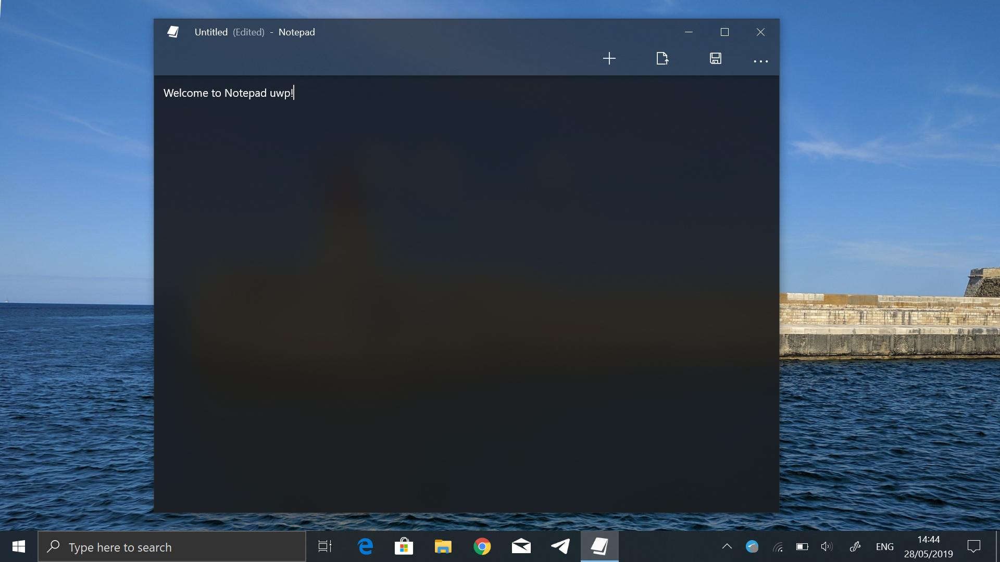
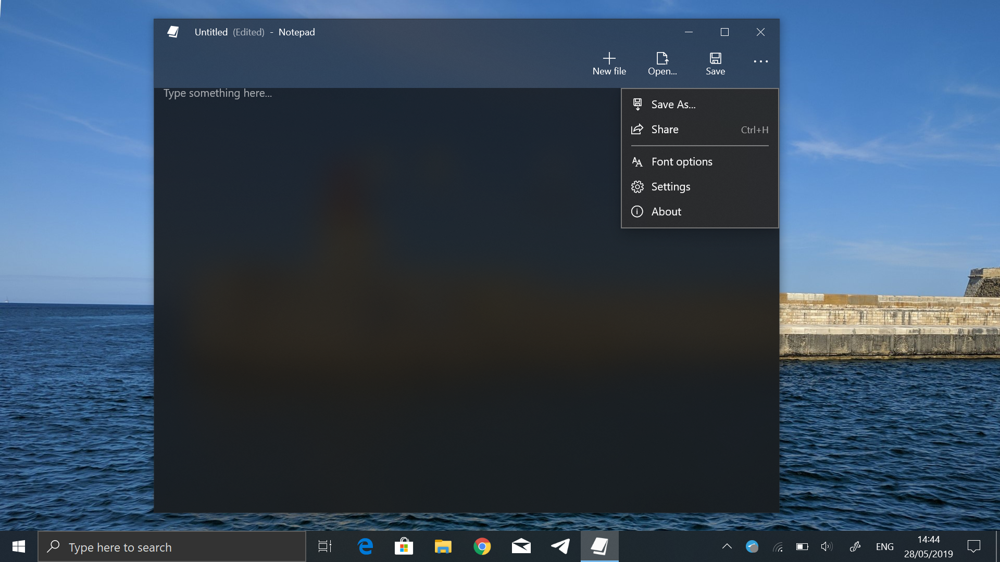
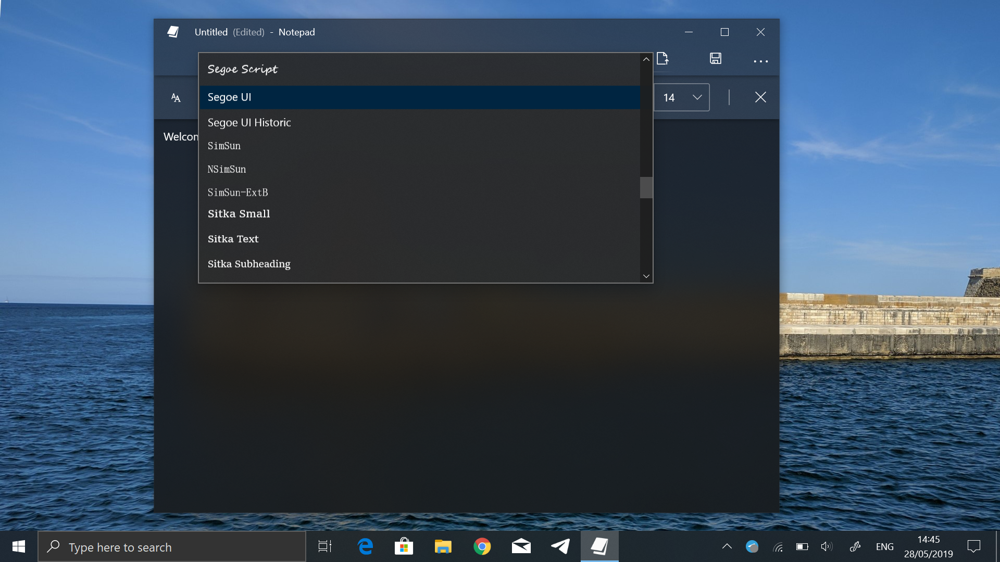
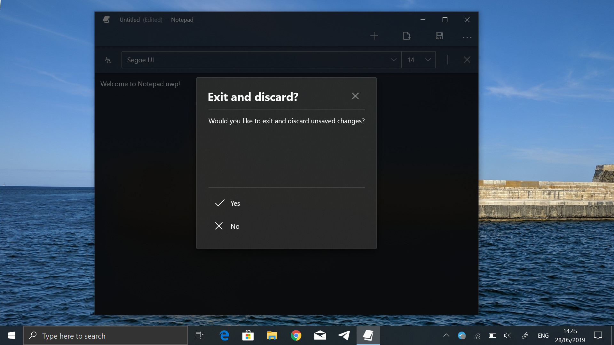

# Sharpnote - Windows Text Editor


If you're tired of complicated, feature-heavy notepads that are difficult to use, give our lightweight option a try. Its minimalistic design is easy on the eyes and intuitive to navigate. With just the right amount of features to meet your needs, this notepad is perfect for anyone looking to streamline their workflow and stay focused on the task at hand.

#### A lightweight, non-bloated, simple in use notepad - adequate to all needs.

The name and whole concept was inspired from Notepad++.


There are a lot of other text editors: VSC, Vim, Sublime etc. 
But, I always had a feeling that each one of them did not have what the rest had.

So, the main goal of this project, is to combine all the best things that they have - together!


### Screenshots

##### Standard design for text editor:



##### Able to open files and display them into the editor:

* Line/Column numbers also show according to where your cursor is selected



##### Able to see an example of the color before you choose it:




* Uses a KnownColor object for the selected color. Once backcolor is set, it converts the color to RGB values and
determines if its considered a lighter or darker color. It then changes the text color accordingly:
  * The following is the C# snippet:
  ```csharp
  // fill colors in color drop down list
            foreach (System.Reflection.PropertyInfo prop in typeof(Color).GetProperties())
            {
                if (prop.PropertyType.FullName == "System.Drawing.Color")
                {
                    colorList.Add(prop.Name);     
                }
            }
           
            // fill the drop down items list
            foreach(string color in colorList)
            {
                colorStripDropDownButton.DropDownItems.Add(color);
            }

            // fill BackColor for each color in the DropDownItems list
            for (int i = 0; i < colorStripDropDownButton.DropDownItems.Count; i++)
            {
                // Create KnownColor object
                KnownColor selectedColor;
                selectedColor = (KnownColor)System.Enum.Parse(typeof(KnownColor), colorList[i]);    // parse to a KnownColor
                colorStripDropDownButton.DropDownItems[i].BackColor = Color.FromKnownColor(selectedColor);    // set the BackColor to its appropriate list item

                // Set the text color depending on if the barkground is darker or lighter
                // create Color object
                Color col = Color.FromName(colorList[i]);

                // 255,255,255 = White and 0,0,0 = Black
                // Max sum of RGB values is 765 -> (255 + 255 + 255)
                // Middle sum of RGB values is 382 -> (765/2)
                // Color is considered darker if its <= 382
                // Color is considered lighter if its > 382
                sumRGB = ConvertToRGB(col);    // get the color objects sum of the RGB value
                if (sumRGB <= MIDDLE)    // Darker Background
                {
                    colorStripDropDownButton.DropDownItems[i].ForeColor = Color.White;    // set to White text
                }
                else if (sumRGB > MIDDLE)    // Lighter Background
                {
                    colorStripDropDownButton.DropDownItems[i].ForeColor = Color.Black;    // set to Black text
                }
            }
  ```


##### Icons on each menu item in the menu bar:



### Prerequisites

Requires *Visual Studio 2017 or higher* to debug. 

## Built With

* C# Windows Forms

## Contributing

[Coming Soon]

## Authors

* **Verdancy** - *Initial work* - [Verdancy]( https://github.com/Verdancy )

## License

This project is licensed under the MIT GPL-3.0 license - see the [LICENSE.md](LICENSE.md) file for details


